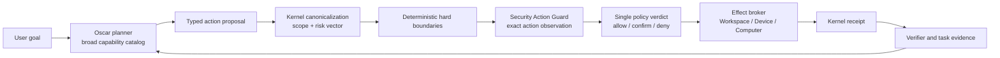

# Oscar Action Guard V1

Status: accepted architecture; the broad-tool runtime slice and source/native Computer Use V1 are implemented. Installed release acceptance remains open.

## Decision

Oscar receives a broad operational toolset. Safety is enforced at the exact action boundary, not by hiding most tools from the planner.

The runtime keeps two independent user controls:

1. **Autonomy scope** — where ordinary actions may run without a prompt.
2. **Security reaction** — what Monarch Security does after it detects a risky exact action.

Changing either control must not silently change the other one.

## Runtime ownership

- Oscar owns planning and tool choice, but cannot grant itself authority.
- Kernel owns canonical action identity, approval binding, leases, dispatch and receipts.
- Security produces action facts and a requested reaction. It does not replace Kernel or create a second execution path.
- Modules own effects and deterministic readback.
- The verifier, not model prose, decides whether the task is complete.

## Autonomy scope

All three modes expose the same eligible tools.

| Mode | Ordinary local behavior | Confirmation boundary |
| --- | --- | --- |
| `guided` | Reads are autonomous | Every mutation, execution and network action |
| `workspace-autonomous` | Reads and reversible project mutations are autonomous | External, irreversible, identity and sensitive actions |
| `full-local` | Ordinary user-level local filesystem and device actions are autonomous | Irreversible or high-impact actions selected by policy/Security |

`full-local` is not a bypass. It authorizes ordinary paths outside the workspace, while canonical red zones, drive-root destruction, Monarch Safe, secret exfiltration and critical system boundaries remain enforced.

## Security reaction target

Security reaction is separate from autonomy scope:

| Reaction | Target behavior |
| --- | --- |
| Observe | Record the exact action and risk facts; do not veto ordinary actions |
| Guard | Allow ordinary actions; request confirmation or block when concrete danger is detected |
| Confirm all | Require an exact durable action-card for every model-proposed effect |

Current runtime already has Security Off, adaptive guarding, always-confirm, permanent capability blocks and exact approval binding. A future UI pass should present them as the reaction choices above instead of mixing them with filesystem scope.

## Broad capability catalog

The planner must understand the whole task before an exact action shortlist is built.

- Planning receives up to 24 compact capability cards.
- Balanced execution receives up to 12 schema-complete cards.
- Several globally relevant tools are retained together with a stable cohort from the leading operational module.
- Fast execution remains intentionally narrow only for an unambiguous single step; any multi-step, recovery, destructive or evidence-bearing turn uses Balanced.
- Permission posture is diagnostic input. It never removes an otherwise eligible tool from the resolver.

This keeps local-model input bounded while avoiding the previous one-to-five-tool bottleneck.

## Coder lessons

Reusable strengths:

- long model -> action -> receipt loop;
- stable project toolset;
- batched independent observations;
- durable receipts and restart quarantine;
- terminal answers rejected until evidence exists.

Not reusable as-is:

- Coder-only policy bypasses;
- unconditional `full-local` / `approvalPolicy: never` overrides;
- a separate authority model;
- project-only assumptions for general desktop work.

Coder remains an experimental client of the shared runtime until these differences are removed and independently tested.

## Computer Use provider contract

Computer Use plugs into the same action boundary:

1. Select one exact target window/session.
2. Produce a fresh UI Automation/DOM/vision observation with an observation id.
3. Oscar proposes one semantic action against that fresh observation.
4. Kernel and Security evaluate the exact action and target.
5. The provider performs one action through the real cursor/keyboard or a semantic adapter.
6. Immediately refresh observation and attach a receipt.

Stale coordinates, stale observation ids and ambiguous target windows are rejected. UI Automation or DOM is preferred; vision coordinates are a fallback. Secure desktop, credential entry and Monarch Safe are not generic Computer Use targets.

## Background activity contract

Every runtime can project the same quiet activity events:

- observation viewed;
- file/tool action started;
- action completed or blocked;
- verification completed;
- aggregate file diff and terminal task state.

The default UI shows short human labels and coalesces repeats. Raw commands, prompts, secrets and large receipts stay behind an explicit technical-details view. Computer Use additionally exposes Pause and Stop while it controls the pointer.

## First implemented slice

- Resolver default widened from 5-12 to 8-24 with a stable leading-module cohort.
- Balanced planning widened to 24 compact capabilities.
- Balanced execution widened from at most 5 (sometimes 1) to 12 schema-complete capabilities.
- Safety profiles are regression-tested to expose the same tool window.
- Security Agent Guard now receives trusted filesystem authority from Kernel: Full Local permits ordinary external paths, but red zones remain hard-denied.

The first single-window Computer provider now implements this contract through the shared Kernel/Security boundary, a persisted revocation epoch, one-shot input leases, a persistent Oscar cursor and fresh read-after-action receipts. See `docs/architecture/OSCAR_COMPUTER_USE_V1.md`.

Next: extract the proven tool-session/control-plane pieces into a shared Oscar/Coder loop, finish quiet activity-feed projection, and complete installed multi-application Computer Use acceptance without introducing a separate authority path.
