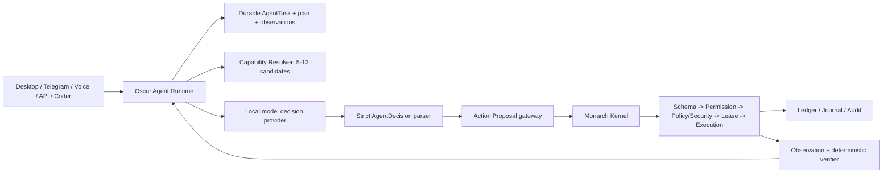
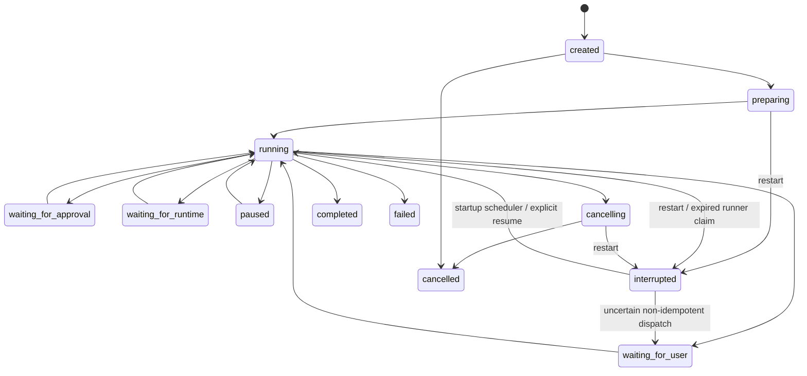
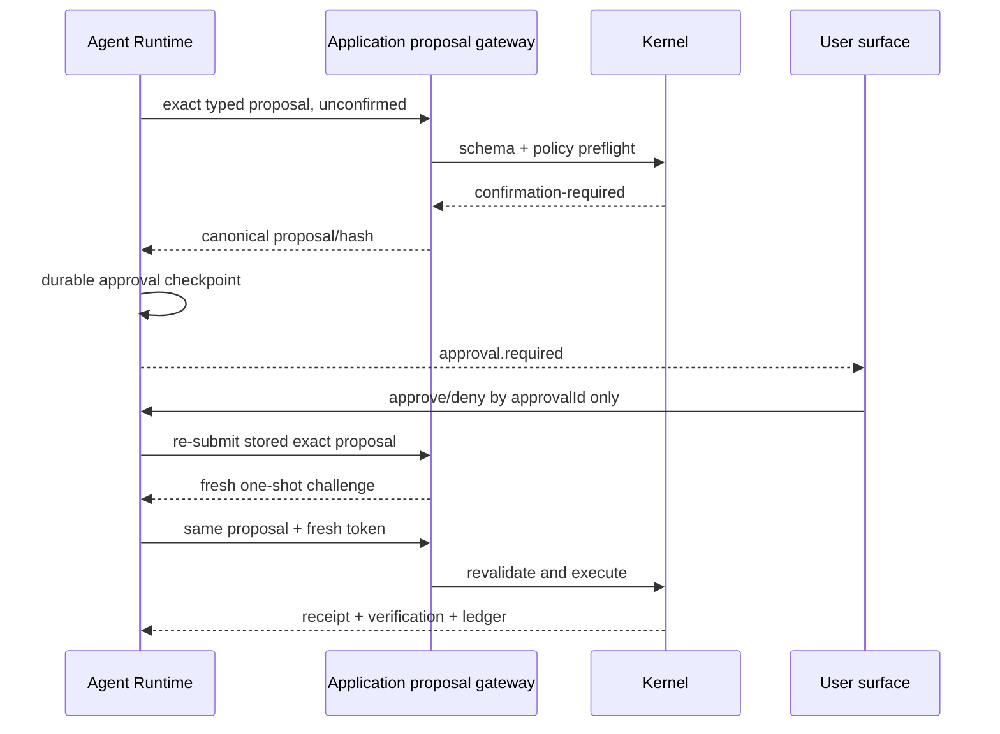

# Oscar Agent Runtime V2

> Status: Phases A-D are implemented behind the default-off `MONARCH_AGENT_RUNTIME_V2` flag on branch `codex/oscar-agent-runtime-v2`. Current-state findings were verified against starting commit `365f0d0`; surface adapters remain Phase E-G work.

## 1. Decision

Monarch remains the execution and safety platform. Oscar becomes the single agent identity. A new `src/agent` service, owned by `MonarchApplication`, owns durable user tasks and the bounded model/tool loop.

The Agent Runtime is **not** a module and is not registered in `src/modules/catalog.ts`. Registering the orchestrator as a capability would allow recursive self-routing and blur ownership. The Kernel remains authoritative for capability contracts, schema validation, permissions, Policy/Security, leases, idempotency, execution, rollback, audit and mutation truth.



The first slice adds the shared backend runtime and versioned task API behind `MONARCH_AGENT_RUNTIME_V2`. Existing surface routes stay unchanged until compatibility adapters are proved.

## 2. Verified current state

Live `npm run status` on 2026-07-22 reported 21/21 active modules, 202 capabilities and 6/6 model groups. `app.version` still reports the known stale `0.1.0`; package version is `0.2.3.1`.

### Desktop main chat

`src/ui/public/modules/chat-pane.js` -> `submitIntentJob()` in `api.js` -> `POST /api/intent-jobs` in `src/app/http-server.ts` -> `MonarchApplication.submitIntentJob()` in `src/app/application.ts` -> `MonarchKernel.submitIntent()` in `src/core/kernel.ts`.

- Task state is an in-memory `Map`; restart loses jobs.
- Router Mesh chooses one capability once.
- the V1 Planner creates one executable step; the result is stored only inside the in-memory job.
- an execution result is not returned to the model.
- `executePlan()` stops at the first failure; there is no replan.
- cancel aborts only `assistant.reply`; timeout is a `Promise.race` and does not stop a generic capability.
- Kernel safety gates apply to the selected capability.

### Oscar pane

`src/ui/public/modules/oscar-pane.js` calls `oscar.chat.route` and `oscar.chat.stream`; model action proposals are orchestrated recursively in renderer code around `handleTypedActionPlan()`. Python produces bounded typed proposals in `oscar/backend/oscar_agent/main.py`, but pending plans are not durable.

- UI state and Python conversation state are independent owners.
- tool receipts are used for final wording, not fed into a shared next-action loop.
- failure stops the renderer plan rather than causing model replanning.
- Python still performs selected environment/workspace reads and memory writes directly.
- the normal Oscar stream bypasses Router/Planner and enters through direct capability APIs.

### Telegram

`MonarchApplication` installs a dispatcher -> `TelegramModule.dispatchTask()` in `src/modules/telegram/index.ts` -> synchronous `submitIntent()` -> Kernel.

- Telegram persists offsets/pairing/reminders, not an AgentTask.
- a generic task is one Router/Kernel call; native bot commands use separate module orchestration.
- result is formatted for Telegram but not returned to a model.
- task/approval state and cancellation do not survive restart.

### Voice scripted actions

`src/ui/public/modules/oscar-voice-mode.js` -> `voice-mode-dispatch.js` rule classifier -> hard mapping in `api.js` -> direct `/api/execute`.

- UI and `VoiceSessionStore` own transient state.
- there is no plan or replan.
- some Device actions have local read-back, but there is no common goal verifier.
- aborting the renderer fetch does not cancel an already dispatched capability.
- `voice.mode.execute-scripted` is a trusted narrow fast path, not common task semantics.

### Coder

`POST /api/coder/runs` -> `CoderAgentController.start()` -> `executeRun()` in `src/app/coder-agent-controller.ts`.

Coder is the only current path with a real `model -> action proposal -> Kernel receipt -> next model turn` loop. It has a durable run journal and project pinning, but its loop, terminal heuristics and special policy lane are Coder-specific. On restart, running work becomes failed rather than resumable.

### Direct capability API

`POST /api/execute` -> `MonarchApplication.executeCapability()` -> `kernel.execute()` -> `ExecutionEngine.execute()`.

The caller chooses the capability. There is no AgentTask, goal, plan, cancellation, checkpoint or replanning. Schema/permission/policy/security still apply. The public body does not expose the complete proposal predicate/idempotency contract.

## 3. Confirmed duplication and gaps

- Desktop has two incompatible orchestration paths.
- Python Oscar duplicates workspace, memory, search and chat routing responsibilities.
- Voice, Telegram and renderer code contain domain-specific planning or keyword dispatch.
- Coder owns the only feedback loop, but cannot be reused by other surfaces.
- V1 `MonarchPlan` is a one-route execution description, not durable agent state.
- `ActionLedger` preserves mutations, not task progress.
- pending confirmations and intent jobs are in-memory.
- there is no common observation provenance, terminal goal verifier, no-progress guard or restart recovery.
- cancellation does not propagate through a generic capability worker.

## 4. Ownership map

| State / decision | Authoritative owner in V2 | Non-owner responsibilities |
|---|---|---|
| user goal, task status, plan, current step | Oscar Agent Runtime | surfaces submit messages and render state |
| task/checkpoint/event persistence | AgentTaskStore | Application selects the store |
| next action / ask / complete decision | model through strict AgentDecision | deterministic fallback can fail truthfully |
| relevant capability candidates | CapabilityResolver | manifests provide metadata; runtime provider reports availability |
| capability schema and module ownership | Kernel registry | Agent Runtime never invents tools |
| permission, policy, Security, lease | Kernel / Application action gateway | Agent Runtime pauses and exposes exact approval |
| execution and real side effects | Execution Engine / module executor | Agent Runtime only dispatches typed proposals |
| mutation replay and rollback | ActionLedger / MutationJournal | persist action-side truth; direct task recovery reconciliation remains pending |
| factual tool observation | ObservationNormalizer from receipt | model interpretation is separate |
| expected-effect verification | ResultVerifier, preferring deterministic predicates | model semantic review is optional and non-authoritative |
| conversation / episodic memory policy | future unified Memory Service | existing stores remain adapters during migration |
| local model process truth | future Model Runtime Manager | decision provider consumes a lease/lane |

No task may have independent authoritative state in both TypeScript and Python.

## 5. Component boundaries

```text
src/agent/
  types.ts                     JSON-serializable V2 contracts
  decision-schema.ts           strict discriminated-union parser
  agent-task-store.ts          CAS, atomic persistence, runner claims, event replay
  checkpoint-manager.ts        mandatory checkpoint policy
  budget-manager.ts            wall/model/tool/failure/no-progress limits
  runtime-availability.ts      registered/configured/reachable/ready/health truth
  capability-resolver.ts       bounded deterministic retrieval + diagnostics
  context-compiler.ts          bounded, redacted, untrusted-data-labelled context
  model-decision-provider.ts   local model adapter with JSON hint and AbortSignal
  plan-manager.ts              incremental plan and revisions
  observation-normalizer.ts    receipt -> redacted factual observation
  result-verifier.ts           expected effects and completion gate
  recovery-policy.ts           retry/replan/wait/fail classification
  agent-loop.ts                one bounded decision/action iteration owner
  agent-runtime.ts             public lifecycle API and concurrency control
  index.ts                     exports
```

`MonarchApplication` constructs this service only when the feature flag is enabled. `bootstrap.ts` and the module catalog stay unchanged.

## 6. Core contracts

The persisted types are JSON-only. Hidden chain-of-thought, compiled system/developer prompts and raw model output are never fields. The original user request and user-visible task messages are durable task state and are redacted/bounded when compiled back into model context.

```ts
type AgentTaskStatus =
  | "created" | "preparing" | "running"
  | "waiting-for-user" | "waiting-for-approval" | "waiting-for-runtime"
  | "paused" | "interrupted" | "cancelling"
  | "completed" | "failed" | "cancelled";

interface AgentTask {
  schemaVersion: "monarch.agent-task.v2";
  id: string;
  traceId: string;
  source: AgentSource;
  conversationId?: string;
  parentTaskId?: string;
  clientRequestId?: string;
  goal: AgentGoal;
  status: AgentTaskStatus;
  plan?: AgentPlan;
  currentStepId?: string;
  activeApprovalId?: string;
  activeLeaseId?: string;
  pendingAction?: AgentPendingAction;
  pauseRequested?: boolean;
  cancellationRequested?: boolean;
  messages: AgentTaskMessage[];
  observations: AgentObservationReference[];
  artifacts: AgentArtifactReference[];
  approvals: AgentApprovalReference[];
  budgets: AgentBudgetLimits;
  usage: AgentBudgetUsage;
  contextSnapshot?: AgentContextSnapshotReference;
  checkpointVersion: number;
  eventSequence: number;
  runnerClaim?: AgentRunnerClaim;
  recovery?: AgentTaskRecovery;
  createdAt: string;
  updatedAt: string;
  completedAt?: string;
  terminalReason?: AgentTerminalReason;
}
```

`AgentGoal` contains the original request, normalized objective, expected outputs, constraints, success criteria and user preferences. Goal normalization is deterministic and bounded; the model may refine a plan, not silently rewrite the user's goal.

### Incremental plan

An initial plan is short. Each decision adds or revises the nearest executable step. Dependencies, expected effects, verification and skipped/replacement steps remain explicit. V1 `MonarchPlan` stays a compatibility type.

### AgentDecision

Allowed decisions are `inspect`, `act`, `ask-user`, `wait-runtime`, `revise-plan`, `complete` and `fail`. Each object has an exact key allowlist and bounded strings/arrays.

Executable decisions must satisfy all of these:

1. strict `JSON.parse()` of the complete model response; Markdown/fenced or embedded JSON is rejected;
2. strict discriminated-union validation;
3. capability ID is in the current Resolver result;
4. input validates against the capability schema;
5. mutating/external actions define verification before execution;
6. no raw secret-bearing fields;
7. one bounded repair attempt, then truthful failure.

Model text, Markdown, shell fragments and invented tool calls never execute.

## 7. Task state machine



Terminal states are immutable. `completed` requires the completion verifier. A running action first becomes `cancelling`; the Agent stage then settles cooperatively or bounded-detaches. If a worker did not attest that it stopped, its `pendingAction` remains durably `dispatched` rather than being rewritten as a completed receipt.

## 8. Bounded loop

1. claim the task with a cross-process runner lease;
2. load the newest checkpoint and durable pending-action state;
3. stop on cancellation, pause or budget exhaustion;
4. compile bounded redacted context;
5. resolve 5-12 available capabilities;
6. request one structured model decision;
7. strictly validate or perform one repair;
8. for an action, checkpoint the exact proposal before dispatch;
9. execute through `MonarchApplication.submitActionProposal()` and therefore the existing Kernel chain;
10. normalize the receipt, verify expected effects, update plan and checkpoint;
11. continue, replan, wait or terminate.

A failed tool does not automatically fail the task. Recovery policy records whether the same action is retryable; the next model turn may select an alternative. Repeated no-progress or exhausted budgets ends with a truthful failure.

## 9. Durable store and recovery

Default state lives under `runtime/agent/` only while V2 is enabled. Tests inject an in-memory store.

Implemented Phase D semantics:

- version and required-field validation; corrupt state fails closed and is not overwritten;
- atomic temp-file replacement with surfaced errors;
- heartbeat-backed cross-process lock around read-check-write, with an ownership fence immediately before replacement;
- compare-and-swap on `checkpointVersion`;
- per-task runner claim with owner, expiry and renewal;
- idempotent `clientRequestId` and message IDs;
- monotonic per-task event sequence;
- compiled prompts and raw model output are not persisted; execution metadata is bounded and redacted.

Cross-task retention/compaction is not implemented yet. User-authored requests/messages are durable by design and therefore must be treated as potentially sensitive input, not as guaranteed secret-free data.

On restart:

- terminal tasks remain terminal;
- waiting-user and waiting-approval remain durable waiting states;
- `preparing`, `running` or `cancelling` with an expired runner claim become `interrupted`;
- interrupted tasks are scheduled automatically when the runtime starts;
- a pending non-idempotent dispatch moves to `waiting-for-user` recovery review and is never automatically repeated;
- direct ledger/environment reconciliation before an idempotent retry remains Phase E work; the Kernel ledger, canonical idempotency key and deterministic postconditions still fence any eventual re-dispatch;
- the exact proposal is re-preflighted and receives a fresh ephemeral confirmation challenge after durable user approval.

## 10. Approval flow



The client cannot replace proposal input, target or canonical hash. Approval expires and is one-shot. A task lease remains bounded by capabilities, roots, time and budgets; it never bypasses per-action policy. Money, identity, Security-sensitive and irreversible external effects are never silently widened by Full Access.

## 11. Capability retrieval and metadata

`MonarchCapability.agent` is optional. A resolver produces a conservative full metadata object from the legacy risk when it is absent. Defaults affect retrieval/diagnostics only and never weaken Policy Kernel semantics.

The first annotated set is `workspace.root.get`, `workspace.files.list/read/search/write`. Manual-review inventory includes model completion, Studio edits/history, Oscar conversation/memory mutation, scripted Voice, Telegram API, Security PIN/response actions and custom tools.

Resolver inputs include goal, current step, observations, module status, tags/aliases/schema, supported sources, runtime readiness/health, permission profile, credentials references, latency and compute class. It excludes unavailable/source-forbidden capabilities and `custom-tools.auto-create -> execute` chaining. A degraded-but-ready runtime remains available with a warning; configured is not equivalent to reachable.

Diagnostics record included candidates and concise exclusion reasons. Only the included cards enter model context.

## 12. Observation and verification

An observation separates tool facts from model interpretation. It contains receipt status, bounded structured data, provenance, evidence, state delta, artifacts, warnings and retryability. Dedicated redaction removes tokens, credentials, authorization headers and secret-like values.

The verifier validates output schema when declared and prefers existing deterministic predicates: `exists`, `not-exists`, `equals`, `contains`, `status` and `result.*`. A write that returned `ok:true` without its required verification cannot satisfy completion. Verification failure produces partial/failed observation and replan; it never becomes a success message.

## 13. Context, memory and prompt-injection boundary

Context contains the stable goal, concise current plan, bounded recent observations, user messages, candidate capability cards and optional matched skill summaries. Tool/file/web/skill content is explicitly marked untrusted data. Candidate membership and schema validation, not model prose, authorize actions.

The target Memory Service scopes are working, conversation, episodic, semantic, profile, project and temporary. Existing Monarch/Profile/Oscar stores remain adapters. Model guesses never become durable memory without an explicit policy reason. Coder project context never receives unrelated Monarch registry/profile records.

## 14. Cancellation and budgets

Budgets cover steps, model turns, tool calls, wall time, failures, consecutive no-progress and compute class. Exhaustion is a failed terminal state, not completion.

The model provider accepts `AbortSignal`. `MonarchExecutionControl` carries the signal through Application, Kernel and Execution Engine to every module worker; the initial `workspace.files.write` adapter consumes it. Model and pure local observation stages may bounded-detach after abort, while effectful capabilities are excluded unless their metadata declares cooperative cancellation support. `cancelled` settles Agent ownership but does not claim an ignored worker stopped; unverified dispatched work remains explicit in task state.

## 15. Runtime and model management target

Availability states are `registered`, `configured`, `reachable`, `starting`, `running`, `degraded`, `stopping`, `stopped`, `unavailable`, with readiness and health represented separately.

The future Model Runtime Manager owns leases, consumer identity, lane, priority, memory estimate, load/unload, queue, preemption, cancellation and timeout. Initial lanes are interactive-chat, agent-planning, agent-verification, voice-realtime, coder, background and sharing. V2 works with one local model; planner/actor/verifier model separation is optional optimization.

## 16. API and events

Routes follow existing conventions; the representation is versioned:

```text
POST   /api/agent/tasks
GET    /api/agent/tasks
GET    /api/agent/tasks/:id
POST   /api/agent/tasks/:id/messages
POST   /api/agent/tasks/:id/pause
POST   /api/agent/tasks/:id/resume
POST   /api/agent/tasks/:id/cancel
GET    /api/agent/tasks/:id/events
POST   /api/agent/tasks/:id/approvals/:approvalId
```

HTTP always assigns source `api`; it does not trust caller-supplied `telegram` or `system`. Mutation origin/session/loopback guards remain mandatory. Request bodies are route-bounded rather than inheriting the 50 MB media limit.

Events have durable sequence and envelope `{version,id,sequence,taskId,traceId,type,createdAt,payload}`. SSE subscribes before replay, deduplicates buffered/live events, supports `Last-Event-ID` or `after`, sends heartbeat comments and closes after the persisted terminal event. Dotted event names use an exact allowlist.

Required types include `task.created`, `task.status.changed`, `plan.created`, `plan.revised`, `step.started`, `resolver.completed`, `model.started`, `model.completed`, `approval.required`, `approval.resolved`, `tool.started`, `tool.completed`, `observation.created`, `verification.completed`, `artifact.created`, runner lifecycle events and terminal task events. Model diagnostics contain bounded status/timing data, never raw prompts or model output.

## 17. Surface and connector migration

- Desktop: first becomes a task viewer/approval client; later creates V2 tasks by default.
- Telegram: creates/continues the same AgentTask; remote restrictions remain.
- Voice: conversational fast path can stay isolated, but actions create/continue AgentTask and speak only verified outcomes.
- Coder: preserves UI/project isolation/sandbox, but becomes a scoped capability/skill adapter for the common loop.
- GitHub, Hugging Face, Gmail, Calendar and generic HTTP connectors expose typed read/write-separated capabilities with credential references rather than secret values, account identity, preview, effect classification, confirmation, idempotency, rate limits, audit, revocation and runtime status.
- Sites and Creative Production are not publication authorities for this private checkout. No site/model/artifact is uploaded as part of the first slice.
- Safe content is never promoted to a general capability or connector.

Computer/browser providers fit the same registry instead of receiving a separate agent loop:

- process/window capabilities list, inspect, focus, launch and close with explicit process/window state verification;
- Windows UI Automation inspects the accessibility tree and invokes semantic controls before any visual fallback;
- visual fallback is bounded to a named window/region and requires post-action state verification; raw coordinates are not the primary contract;
- clipboard read/write/clear is sensitivity-aware and separately permissioned;
- browser capabilities use a managed session, DOM/page snapshots, bounded click/type/select/tab/download operations, domain restrictions, prompt-injection labels and confirmation for external effects.

These capability families are target contracts only in Phase D; no browser/computer executor was invented for the workspace slice.

## 18. Compatibility and migration

1. Phase A (implemented): verified call paths, ownership map, gap analysis, characterization tests.
2. Phase B (implemented): types, strict store, events, context, plans, observations, budgets and checkpoints.
3. Phase C (implemented): resolver, action gateway, verification, cancellation control and availability.
4. Phase D (implemented): workspace report vertical slice, failure recovery, feature flag, evaluation fixture and versioned API/SSE.
5. Phase E (pending): adapters for current chat, intent jobs and assistant.
6. Phase F: memory/skill/capability registries and Tool Forge boundary.
7. Phase G: Desktop, Telegram, Voice and Coder surface migration.
8. Phase H: remove legacy UI/Python orchestration only after parity and migration reports.

Old `/api/intent-jobs`, `/api/agent/jobs`, `/api/execute`, Python chat and Coder routes remain operational in Phase D. The flag defaults off.

## 19. Rejected alternatives

- monolithic `OscarAgentController`: recreates existing hotspots and untestable ownership;
- extending IntentJob: in-memory job semantics cannot provide durability or approvals;
- registering Agent Runtime as a module/capability: creates recursive orchestration;
- new Python/TS bridge per use case: preserves split authority;
- renderer-owned plan: loses restart/cross-surface state;
- hardcoded workspace-report route: passes a demo while leaving the architectural gap;
- all capabilities in prompt: increases tool confusion and injection surface;
- direct model text execution or permissive embedded-JSON extraction: violates the action boundary;
- big-bang migration: risks current chat, Coder, Voice, Telegram and release behavior.

## 20. Security invariants

- model text never executes directly;
- strict decision and capability input validation precede execution;
- Permission Gate, Policy/Security and canonical action-bound confirmation remain authoritative;
- proposal targets, leases and approvals are revalidated before dispatch;
- ledger/idempotency blocks unsafe replay; journal history is preserved;
- observations/events are bounded and redacted; no hidden reasoning is stored or streamed;
- mutation APIs retain loopback, origin and session-token guards;
- Coder project roots and environments remain isolated;
- `/api/ready` and `/api/health` remain distinct;
- Security lifecycle remains independent of ordinary Desktop exit;
- Production Monarch Safe is never read, listed, scanned, mutated or used for QA.

## 21. Phase D acceptance

The slice is accepted only when a real temp-workspace task reads multiple files, writes a Markdown report through the Kernel action gateway, deterministically verifies file existence/content, emits durable typed events, survives restart semantics, supports cancel, replans after a recorded tool failure, respects approval, stops on budgets and passes existing regressions. The truthful handoff wording is:

```text
foundation implemented
vertical slice operational
surface migration pending
```
