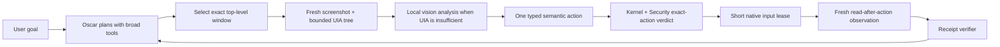
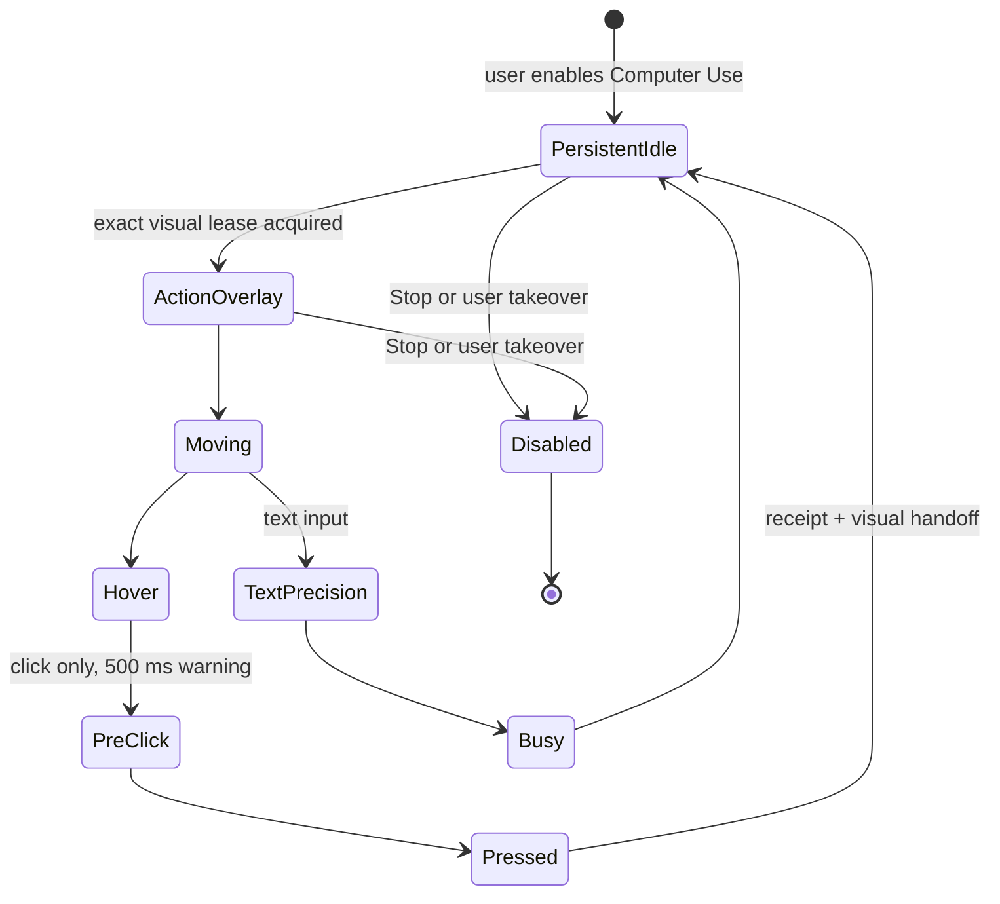

# Oscar Computer Use V1

Status: source implementation and native single-window acceptance are complete; installed Electron and release acceptance remain open.

## Product decision

Computer Use is not a second autonomous runtime. Oscar keeps the same broad planning freedom as for files and Coder, while Kernel remains the only authority that can grant one exact effect. Monarch Security observes that exact effect and applies the user's selected reaction instead of hiding most tools from Oscar in advance.

The minimum trustworthy loop is:

Model prose, a cursor animation and a UI success label are never evidence that an action happened. Completion requires the native receipt and a new observation of the same exact window.

## Ownership boundaries

| Owner | Responsibility | Must never own |
| --- | --- | --- |
| Oscar | Goal decomposition, tool selection, semantic target choice and recovery planning | Permission, input dispatch or success truth |
| Kernel | Canonical action identity, scope, policy verdict, exact approval binding, lease creation and audit receipt | Visual interpretation or model reasoning |
| Monarch Security | Observe the concrete action and risk facts; request allow, confirm or deny according to the user's reaction mode | A parallel execution path |
| Computer module | Exact-window observation, one native input atom, cursor lifecycle and deterministic readback | Broad autonomous policy |
| Verifier | Decide whether receipts satisfy the intended effect | Trust model prose |

## Freedom and safety are separate controls

Oscar sees the same eligible capability catalog in every autonomy mode. The autonomy mode changes which exact actions may proceed without confirmation; it does not cripple planning by removing tools.

Security reaction is an independent user choice:

| Reaction | Runtime behavior |
| --- | --- |
| Observe | Log exact action facts and allow ordinary actions. Deterministic hard boundaries still apply. |
| Guard | Allow ordinary actions; interrupt only when a concrete dangerous condition is detected. |
| Confirm all | Require an exact durable action card for every model-proposed effect. |

No mode bypasses protected red zones, secure desktop, password fields, ambiguous windows, stale observations, destructive drive-root actions or Production Monarch Safe. These are deterministic boundaries, not model judgments.

## Exact observation and action contract

1. `computer.windows.list` returns opaque `windowRef` values for visible top-level windows.
2. `computer.window.observe` captures one exact window, bounded UI Automation data, focused element, screenshot digest and state fingerprint.
3. `computer.window.analyze` may ask local Oscar Vision for bounded server-owned target handles. Raw model coordinates never become direct authority.
4. An action must reference the latest unconsumed observation for the same control epoch and exact window.
5. The module consumes that observation before native dispatch and grants one short input lease.
6. Immediately before every mouse or keyboard atom, the native provider rechecks the persisted epoch, lease id, process, HWND, bounds, title, foreground owner and target identity.
7. After the atom, the provider captures a new observation and binds it to the receipt.

Implemented action atoms are click, Unicode text input, one bounded key chord and one bounded vertical scroll. Each action consumes one observation. Recovery always begins with a fresh observation.

## Oscar cursor lifecycle

The cursor is visible for the entire enabled Computer Use session:

- A long-lived native cursor host owns the subtle idle state.
- A short action overlay acquires `active-visual-lease.json`; the persistent host crossfades out, then resumes at the final logical position after the action.
- Motion uses a critically damped spring at a 60 fps target. Heading comes from the live velocity vector, so rotation, elastic deformation and trail work continuously across all 360 degrees, including diagonals.
- Click warning is a 500 ms vibration that flows into pressed and released states without a hard cut.
- The renderer reads Windows `SM_CXCURSOR`. The complete rotated sprite diagonal, after animation scale and directional stretch, is hard-clamped to at most `1.5 ×` the system cursor width. Click rings are clamped inside the same visual envelope.
- The orange overlay is topmost, per-pixel transparent, click-through and non-activating. It never steals focus from the target.
- Native mouse actions temporarily move the real system cursor only for dispatch. If the user has not taken over, it is restored immediately; otherwise Computer Use stops.

Production cursor assets are the seven isolated PNGs in `tools/computer-use/assets/`. The old combined concept sheet is not a runtime sprite source.

## Immediate Stop and takeover

Stop is outside Oscar planning and never requires approval:

- persistent glass control in the main UI;
- global `Ctrl+Alt+Escape` registered by Electron;
- dedicated payload-free local route;
- synchronous control-epoch rotation and lease removal before child termination;
- native provider checks before every input atom;
- cursor fade/hide, observation invalidation and process stop;
- only a direct user action can enable Computer Use again.

Physical movement of the user's cursor during an Oscar action is treated as takeover. The current action becomes unverified/uncertain, Computer Use stops, and a fresh observation is required. The runtime never claims success from an interrupted atom.

## Quiet background activity

The module emits small structured events rather than exposing raw commands or prompts:

- window observed or analyzed;
- cursor moving;
- exact action started, completed or rejected;
- Computer Use enabled, stopped or taken over;
- verification/readback completed.

The default projection belongs in the existing compact activity area and coalesces repetitive observations. Technical receipts, raw paths, prompts and screenshot internals stay behind an explicit details view. While Computer Use is enabled, the Stop control remains visible even when no action is currently running.

## Coder convergence

Coder's useful mechanics are the long tool loop, stable capability set, durable receipts, restart quarantine and refusal to finish without evidence. They should converge on the same shared tool-session/control-plane as Oscar.

Coder-specific `approvalPolicy: never`, unconditional `full-local` and project-only assumptions are not authority primitives. Coder remains experimental until it uses the shared Kernel/Security boundary and passes independent acceptance.

## Failure semantics

- Any target mismatch fails before dispatch.
- Any stale, superseded or already consumed observation fails closed.
- Focus loss immediately before an atom fails closed.
- Stop during dispatch returns no success claim and requires reconciliation through a fresh observation.
- Native helper crash leaves no resumable lease; the next runtime rotates the epoch.
- Secure desktop and credential entry are unsupported, not silently attempted.

## Current evidence and remaining release gate

Source acceptance covers typecheck, focused Kernel/Security/Computer tests, native asset compilation, persistent cursor handoff and a real Windows synthetic-window sequence: observe, click, readback, type and readback.

Still required before calling Computer Use release-ready: installed Electron verification, manual visual acceptance across Windows scaling settings, extended Stop-during-action stress, multiple real applications and a full activity-feed usability pass. Production Monarch Safe is outside this QA scope.
