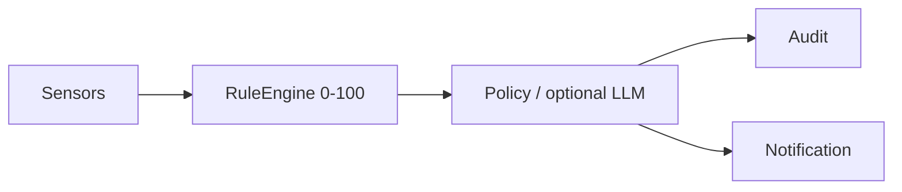

# Security Hardening Proposal: Incident-centered protection control plane

## Decision

We need to choose the authority boundary for the rebuilt Monarch Security before implementing quarantine, network blocking, process control or emergency lock behavior.

## Executive Recommendation

The complete option set is: **Option 1 — Harden the current monolith**, **Option 2 — Local response broker plus privileged Windows service**, and **Option 3 — Driver-assisted endpoint stack**. I recommend Option 2 under the current local-first and incremental-delivery constraints. Option 3 becomes preferable only if measured blind spots prove that user-mode polling and Windows-native firewall/service APIs cannot meet response latency or visibility requirements.

## Evidence

| Evidence | Source | What it establishes |
| --- | --- | --- |
| `E01` | Supervisor event path | Each event is assessed, audited and notified independently; no durable incident state machine exists. |
| `E02` | Event and rules model | Risk is attached to one assessment on a 0–100 scale. |
| `E03` | Policy engine | Destructive LLM suggestions are safely clamped, but there is no execution broker. |
| `E04` | Network sensor | Current coverage is passive PowerShell snapshotting of configuration, neighbors, TCP listeners and established TCP sessions. |
| `E05` | File/process sensors | Polling produces isolated observations; it does not correlate process lineage, file writes and network egress into one attack chain. |
| `E06` | Notification manager | Notifications inform but cannot carry a durable user decision or incident acknowledgement. |
| `E07` | Deep scan | Strong local building blocks already exist and cloud reputation is correctly explicit opt-in. |
| `E08` | Monarch bridge/UI | Manual scans and protection controls exist, but incident inbox, response proposals and containment lifecycle capabilities do not. |
| `E09` | Live stopped/start UX capture | A running PID and raw CLI command are presented as protection feedback; coverage, warm-up, sensor health and next action remain unclear. |

I inspected these paths directly. The strongest influence on the diagnosis is the gap between `SecuritySupervisor._handle_event()` and the UI: the current path ends in audit plus a balloon notification, so there is no owned place to correlate evidence, request a decision, execute a reversible control and verify recovery.

## Current Design And Failure Mode

Observed: Monarch already monitors files, processes, devices, installs, persistence, posture and parts of the network. It can deep-scan a file with local metadata, Authenticode and optional Defender. It deliberately keeps the LLM advisory and clamps destructive actions.

Inferred: adding direct quarantine, firewall writes or desktop locking to the current supervisor would combine untrusted evidence parsing, model output and administrator authority in one long-lived process. A parser error, false positive or model prompt-injection path could then become a denial-of-service or destructive endpoint action. The same structure also makes rollback ownership unclear.

## Desired Invariants

- Every detection becomes a durable incident with evidence, confidence, state, owner, expiry and audit history.
- Risk is 0–800 at incident level; emergency 700–800 cannot be produced by LLM output alone.
- Every system-changing response is allowlisted, scoped, reversible where possible and executed only by a separate broker/service boundary.
- `delete` always requires explicit user confirmation plus Security PIN; default remediation is preserve, isolate or block temporarily.
- Emergency mode cannot replace Windows authentication or trap the legitimate user. It may invoke native workstation lock, time-bounded network containment and a recovery flow.
- External reputation and sample upload remain explicit opt-in and never occur merely because a key exists.
- If the broker/service fails, monitoring degrades visibly and pending actions fail closed; the workstation does not remain silently locked or disconnected.
- The UI exposes one truthful protection state and explains coverage, current activity, degraded sensors and the next user decision without requiring PID/CLI interpretation.

## Constraints And Non-Goals

The first release is Windows-only, local-first and user-mode. We are not claiming antivirus replacement, kernel malware resistance, full packet inspection, TLS decryption or guaranteed detection. We preserve existing scanners and Agent Guard during migration. We do not build a custom lock screen.

## Before Architecture

The current design is a direct sensor-to-decision path.

See [source diagram](../diagrams/security-control-plane-before.mmd). The important missing edge is a durable incident and an owned response boundary between advice and privileged side effects.

## Options

### Option 1: Harden the current monolith

We keep the Python supervisor as both correlation engine and action host, add an incident store, and expose a small set of reversible CLI actions. This is attractive because it reuses nearly all existing code and reaches a useful file-lab and alert inbox quickly. The concern is authority concentration: once the same process watches attacker-controlled files and can modify firewall/process state, future parser or dependency flaws gain a larger blast radius.

| Change | Before | After | Security consequence | Cost |
| --- | --- | --- | --- | --- |
| Incident state | Event/audit only | Durable incidents | Enables acknowledgement and verification | Low |
| Enforcement | Advisory | Same process executes | Adds containment but expands process authority | Medium risk |
| Rollback | Manual | Per-action metadata | Better recovery | Medium |

Rollback is straightforward—disable action capabilities and return to advisory mode—but authority drift remains the principal residual risk.

### Option 2: Local response broker plus privileged Windows service

We keep collectors, UI and LLM unprivileged. A deterministic broker validates a typed response proposal against incident evidence, policy, approval/PIN state, scope and expiry. Only a narrow Windows service receives the validated command and performs allowlisted operations such as moving a file into an ACL-restricted quarantine, adding an expiring firewall rule, suspending or terminating a confirmed process, and restoring prior state.

This option creates a real security boundary without immediately accepting driver development and signing. It adds IPC, service lifecycle and rollback complexity, but those costs arise exactly where we need explicit ownership. A compromised UI or hallucinating model can propose an action; it still cannot invoke arbitrary PowerShell or gain ambient administrator authority.

| Change | Before | After | Security consequence | Cost |
| --- | --- | --- | --- | --- |
| Authority | Supervisor/user context | Narrow service API | Removes ambient admin authority from LLM/UI | Medium-high |
| Emergency mode | None | Corroborated, expiring containment | Enables RAT/ransomware response with recovery | Medium-high |
| Network response | Advisory | Expiring per-app/rule containment | Reduces active command-and-control exposure | Medium |
| Failure behavior | Notification loss | Broker rejects; service watchdog rolls back expiry | Contains bad decisions and stuck controls | Medium |

We can roll this out with the service installed but enforcement disabled, compare shadow decisions, then enable one action family at a time. Rollback is a policy switch plus service uninstall after expiring/restoring active controls.

### Option 3: Driver-assisted endpoint stack

We add a filesystem minifilter, ETW consumers and WFP callouts for lower-latency file/process/network visibility and enforcement. This is the strongest route against fast ransomware and short-lived connections, and it is the only option that can eventually approach endpoint-security depth. It also introduces kernel crash risk, code-signing and update obligations, complex compatibility testing, and a much larger maintenance burden.

| Change | Before | After | Security consequence | Cost |
| --- | --- | --- | --- | --- |
| Visibility | Polling snapshots | Near-real-time kernel/user telemetry | Closes short-lived activity gaps | Very high |
| Enforcement | None | Pre-execution/network callout | Strongest prevention | Very high reliability risk |
| Deployment | Python/TS | Signed drivers and service | Harder for malware to bypass | Very high operational cost |

We should be honest about this option: without a dedicated signing, crash-analysis and Windows-version test program, it could reduce workstation reliability more than it improves security. It should remain a measured follow-on, not Milestone 1.

## Comparison

| Dimension | Option 1 | Option 2 | Option 3 |
| --- | --- | --- | --- |
| Security | Improves, authority still concentrated | Strong improvement with least-privilege boundary | Strongest visibility/enforcement |
| Performance | Small local overhead | IPC/service overhead, expected bounded | Lowest detection latency; kernel overhead unknown |
| Memory | Small incident cache | Additional service and queues | Service plus driver buffers |
| Reliability | Simple but one process owns too much | Better failure isolation; more lifecycle states | Kernel failures can affect the OS |
| Operability | Easiest | Service install, telemetry and rollback required | Signing, compatibility matrix and crash response |
| Migration | Fastest | Incremental shadow-mode migration | Long foundational program |

All effects are source-derived or hypothetical, not measured. Validation must benchmark idle CPU/RSS, sensor-to-incident latency, burst load, false-positive rate, action/rollback success and service failure recovery on representative Windows machines.

## Recommendation

I recommend Option 2. It matches the requested active protection model while preserving the most important existing invariant: the LLM advises but does not own trust. Option 1 is acceptable only for read-only Milestone 1. Option 3 should win later only if tests show that polling misses attack chains or cannot contain them within the defined response target.

## Evidence Coverage And Residual Risk

| Evidence | Effect under Option 2 | Residual risk |
| --- | --- | --- |
| E01 — independent supervisor decisions | Addresses with incident correlation | Correlator rules can still miss novel chains |
| E02 — 0–100 event score | Addresses with 0–800 incident score | Calibration requires real telemetry |
| E03 — advisory policy only | Preserves and extends with broker | Broker/service defects become critical |
| E04 — snapshot network visibility | Mitigates with policy/enforcement | Short-lived/UDP activity needs ETW/WFP follow-on |
| E05 — isolated file/process events | Addresses with attack graph | Process access restrictions may hide evidence |
| E06 — one-way notification | Addresses with incident inbox/actions | OS notification delivery remains best-effort |
| E07 — local deep scan | Preserves | Defender and signatures are not complete truth |
| E08 — UI lacks lifecycle | Addresses with new capabilities | UI compromise can still submit proposals, not execute directly |

## Migration And Rollout

- Milestone 1: incident schema/store, 0–800 score, correlation, alert inbox and manual file lab; read-only/advisory.
- Milestone 1 also replaces the flat Security command dashboard with a protection overview, explicit startup phases and useful empty/degraded states.
- Milestone 2: quarantine vault with restore, evidence bundle and explicit user confirmation.
- Milestone 3: network center with trusted profiles, per-process connection history and expiring firewall actions.
- Milestone 4: assisted control mode, broker, Security PIN, shadow decisions and reversible process/network containment.
- Milestone 5: emergency policy, native workstation lock integration, watchdog/expiry, recovery tests and optional ETW/WFP experiments.

The five additional protection mechanisms to build across those milestones are: ransomware burst/canary detection; attack-chain correlation across process/file/network/persistence; removable-media and BadUSB trust gating; self-protection/tamper health with signed configuration; and a recovery/evidence vault with safe restore.

## Validation Plan

- Unit-test risk invariants: LLM-only evidence never reaches 700; two independent high-confidence signals are required for emergency.
- Replay inert ransomware, RAT, LOLBin, persistence and exfiltration scenarios through the real incident pipeline.
- Prove every containment action expires or rolls back after broker/service crash.
- Fuzz incident/proposal IPC and reject unknown actions, paths, PIDs, stale incidents and replayed approvals.
- Measure idle and burst CPU/RSS, detection latency and false-positive rate before enabling automation.
- Verify that no cloud request or file upload occurs without per-action opt-in.

## Implementation Work Packages

- WP1: typed event, evidence, incident and response-proposal contracts.
- WP2: append-only incident store, correlation engine and 0–800 deterministic scoring.
- WP3: Monarch capabilities/UI for protection overview, incident inbox, manual deep-file lab and network center navigation.
- WP4: quarantine/evidence vault with restore and audit integrity.
- WP5: local authenticated IPC, response broker and least-privilege Windows service.
- WP6: network trust profiles, connection graph and expiring firewall controls.
- WP7: Security PIN/recovery setup, rate limiting and emergency-mode state machine.
- WP8: adversarial replay, performance gates, staged rollout and rollback tooling.

## Open Questions

- Initial response latency target: 1 second, 5 seconds or 15 seconds?
- Is per-process firewall containment enough for v1, or is UDP/WFP visibility mandatory?
- Should emergency mode ever disconnect all network adapters, or only block the suspicious process/remote endpoints?
- What recovery path is acceptable if the user forgets the Security PIN?
